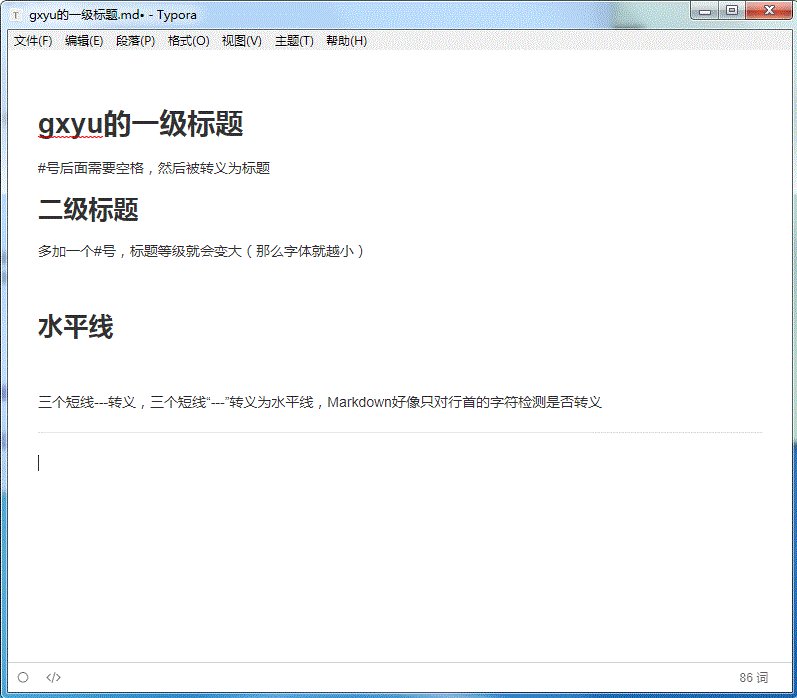

# typora快捷键

## 先右键

## 个人常用：

**加粗** ctrl+b

插入图片 Ctrl+shift+I

插入行内代码 Ctrl+shift+波浪线~：  `import java.utils.List`


```matlab

%% 注释

```


# gxyu的一级标题

#号后面需要空格，然后被转义为标题

## 二级标题

多加一个#号，标题等级就会变大（那么字体就越小）


# 添加图片


手动添加图片，使用相对路径。先"![]"再加()弹出图片选择浏览，选择后在手动修改成相对路径，/





# 段落Markdown


开启一个新的段落。也可以使用空行   [^这是一个脚注]

[^这是一个脚注]: 乌拉拉

## 字体

> ```txt
> *斜体文本*
> **粗体文本**
> ***粗斜体文本***
> 
> _斜体文本_
> __粗体文本__
> ___粗斜体文本___
> ```

实例：

*斜体*     **粗体**    ***粗斜体***

星星符*还能划线

***

## 删除线

两个**波浪**线包围文字即可，~~我乱打的~~

## 图、表、链接、HTML

| 这   | 四   | 三   |
| ---- | ---- | ---- |
| 是   |      |      |
| 一   |      | 列   |
| 个   | 行   |      |

```
1. 第一项：
    - 第一项嵌套的第一个元素
    - 第一项嵌套的第二个元素
2. 第二项：
    - 第二项嵌套的第一个元素
    - 第二项嵌套的第一个元素
```

下面是示例：

1. 第一项：
    - 第一项嵌套的第一个元素
    - 第一项嵌套的第二个元素
2. 第二项：
    - 第二项嵌套的第一个元素
    - 第二项嵌套的第一个元素


Markdown 链接 | 菜鸟教程  http://www.runoob.com/markdown/md-link.html

使用 <kbd>Ctrl</kbd>+<kbd>Alt</kbd>+<kbd>Del</kbd> 重启电脑

