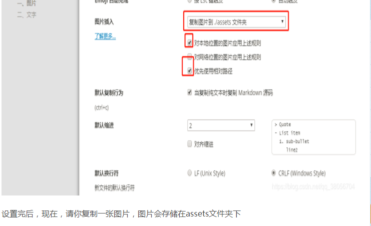

# typora快捷键

## 先右键

## 个人常用：

**加粗** <kbd>ctrl</kbd>+<kbd>b</kbd>


插入代码块 <kbd>ctrl</kbd>+<kbd>shift</kbd>+k

插入行内代码 Ctrl+shift+波浪线~：  `import java.utils.List`


截图可以直接： <kbd>Ctrl</kbd>+c, <kbd>ctrl</kbd>+v

插入本地图片 <kbd>Ctrl</kbd>+<kbd>shift</kbd>+I


# gxyu的一级标题

#号后面需要空格，然后被转义为标题

## 二级标题

多加一个#号，标题等级就会变大（那么字体就越小）


# *添加图片

**优先使用相对路径**，在【文件-偏好设置-图片插入】configure

---

**手动添加图片**，使用相对路径。先"![]"再加()弹出图片选择浏览，选择后在手动修改成相对路径，/


还可以**直接复制粘贴**在光标处，如果在【文件-偏好设置-图片插入】中configure了【复制图片到./xxx.assets文件夹】，图片自动保存到本地。非常方便。




# 段落Markdown


开启一个新的段落。也可以使用空行   [^这是一个脚注]

[^这是一个脚注]: 乌拉拉

## 字体

> ```txt
> *斜体文本*
> **粗体文本**
> ***粗斜体文本***
> 
> _斜体文本_
> __粗体文本__
> ___粗斜体文本___
> ```

实例：

*斜体*     **粗体**    ***粗斜体***

星星符*还能划线

***

## 删除线

两个**波浪**线\~~(正文中打出这两个符号需要转义)包围文字即可，~~我乱打的~~

## 图、表、链接、HTML

| 这   | 四   |的      |
| ---- | ---- | ---- |
| 是   | 行   | 表 |
| 一   | 三   |    |
| 个   | 列   |      |

```
1. 第一项：
    - 第一项嵌套的第一个元素
    - 第一项嵌套的第二个元素
2. 第二项：
    - 第二项嵌套的第一个元素
    - 第二项嵌套的第一个元素
```

下面是生成的文本：

1. 第一项：
    - 第一项嵌套的第一个元素
    - 第一项嵌套的第二个元素
2. 第二项：
    - 第二项嵌套的第一个元素
    - 第二项嵌套的第一个元素


Markdown 链接 | 菜鸟教程  http://www.runoob.com/markdown/md-link.html

使用 <kbd>Ctrl</kbd>+<kbd>Alt</kbd>+<kbd>Del</kbd> 重启电脑